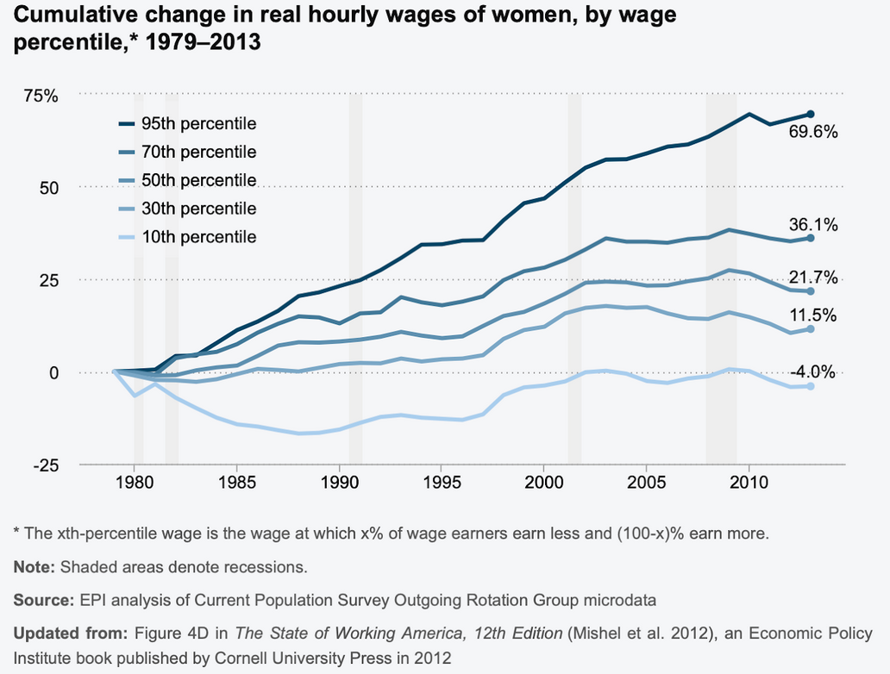
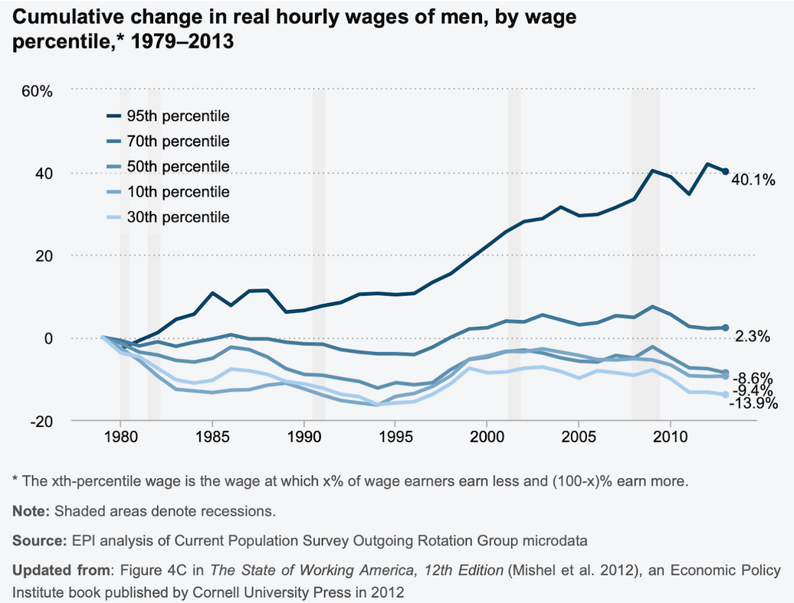
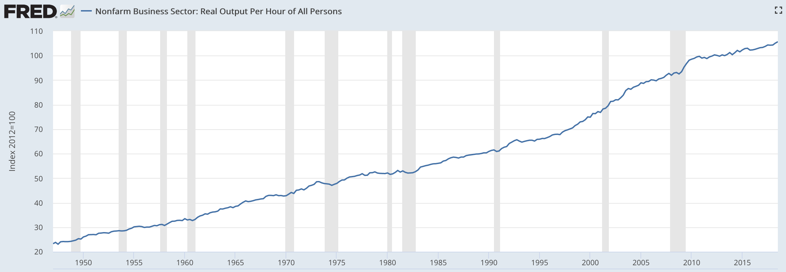
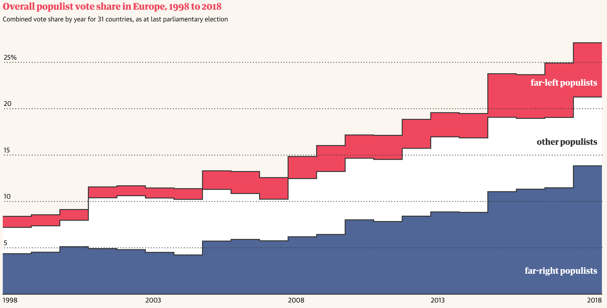
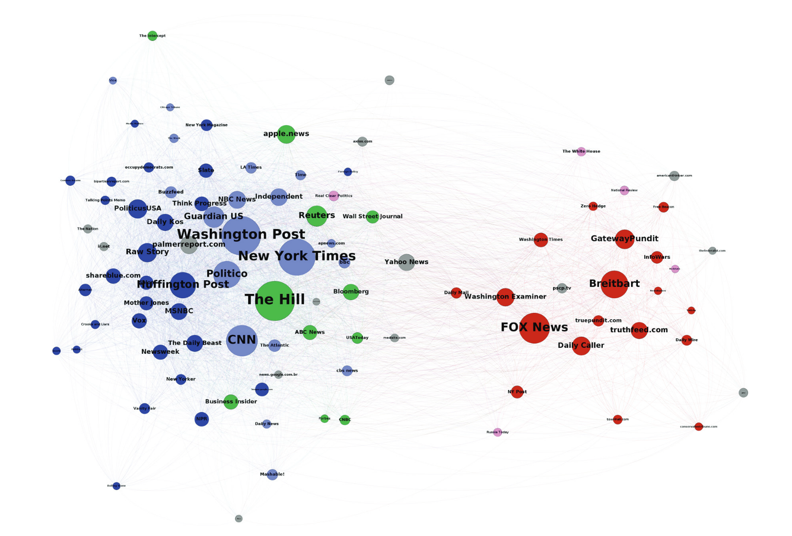
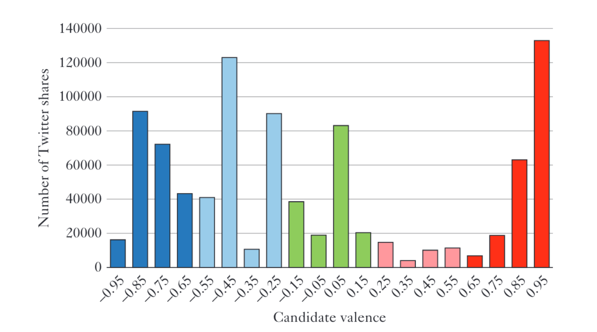
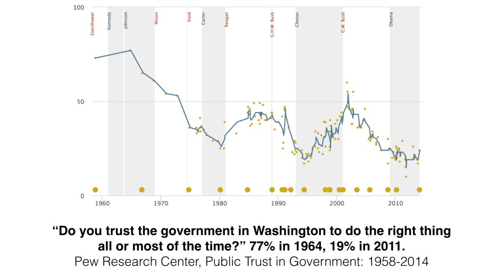
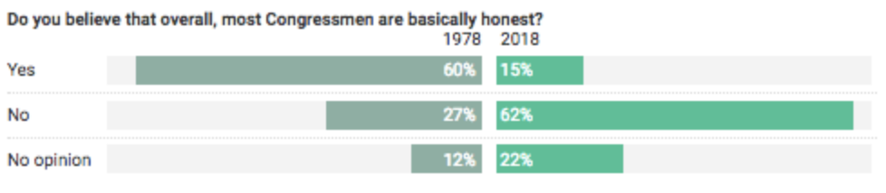
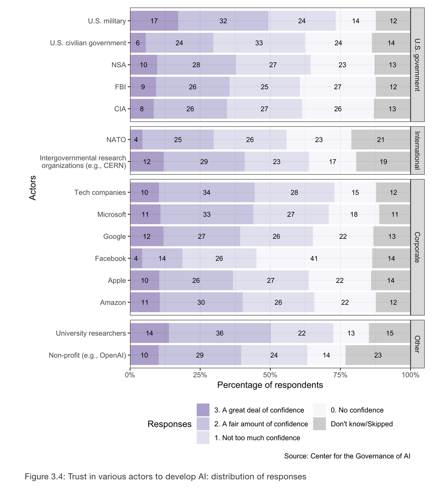
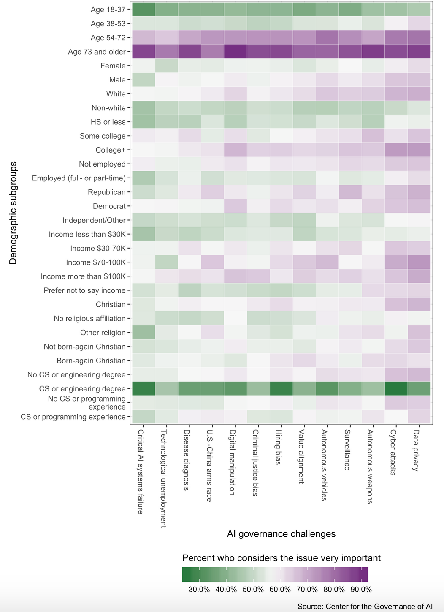

## Wages have stagnated since the '80s

| All  | Women  | Men  |
| :--------------------------------------------------------: | :----------------------------------------------------------: | :--------------------------------------------------------: |
|                                                            | Hourly wage percentiles ([source](https://www.epi.org/files/pdf/why-americas-workers-need-faster-wage-growth.pdf)) |                                                            |

|  |
| :----------------------------------------------------------: |
| ...even though productivity has doubled in that time ([source](https://fred.stlouisfed.org/series/OPHNFB)) |

## Populism is on the rise

|  |
| :----------------------------------------------------------: |
| European populism since 1998 ([source](https://www.theguardian.com/world/ng-interactive/2018/nov/20/revealed-one-in-four-europeans-vote-populist)) |

## The far-right media is a filter bubble

|  |  |
| :----------------------------------------------------------: | :----------------------------------------------------------: |
| 2017 Twitter map for media sources ([Network Propaganda](http://fdslive.oup.com/www.oup.com/academic/pdf/openaccess/9780190923624.pdf)). Colours are quintiles for partisanship among readers (green=neutral). Nodes are linked when the same reader shares both sources. | Histogram of twitter partisanship for top 250 media sources, 2015-16. |

## Nobody trusts the government

|   |  |  |
| :----------------------------------------------------------: | :----------------------------------------------------------: | :----------------------------------------------------------: |
| ([source](http://www.people-press.org/2014/11/13/public-trust-in-government/)) | ([source](https://www.huffingtonpost.com/entry/historical-polls-2018-20th-century-america_us_5c2a47aae4b05c88b7029f37?ks4)) | ([source](https://governanceai.github.io/US-Public-Opinion-Report-Jan-2019/public-opinion-on-ai-governance.html#americans-who-are-younger-who-have-cs-or-engineering-degrees-express-less-concern-about-ai-governance-challenges)) But they trust tech companies more... |

## CS students think AI governance is not very important

|  |
| :----------------------------------------------------------: |
| ([source](https://governanceai.github.io/US-Public-Opinion-Report-Jan-2019/public-opinion-on-ai-governance.html#americans-who-are-younger-who-have-cs-or-engineering-degrees-express-less-concern-about-ai-governance-challenges)) |

